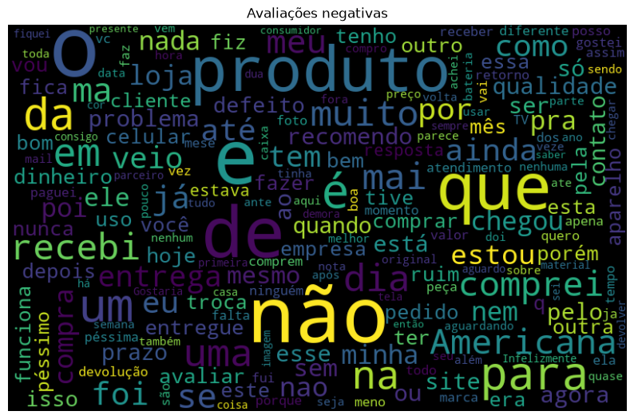
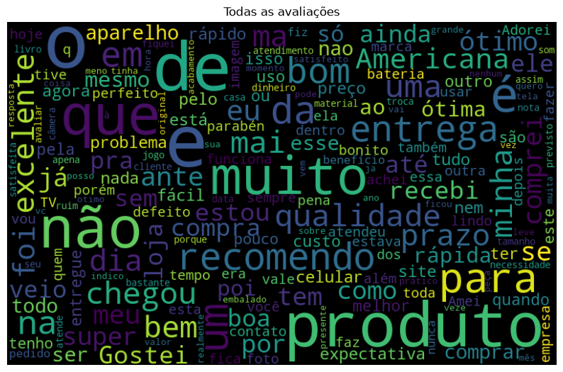
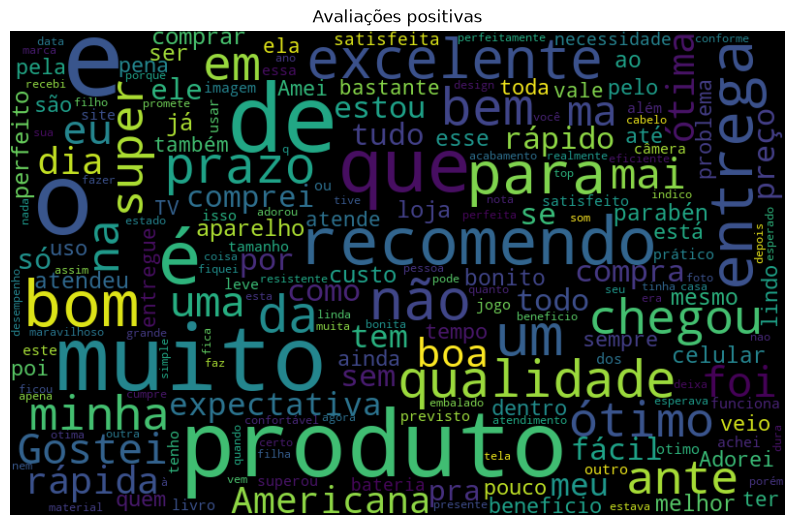
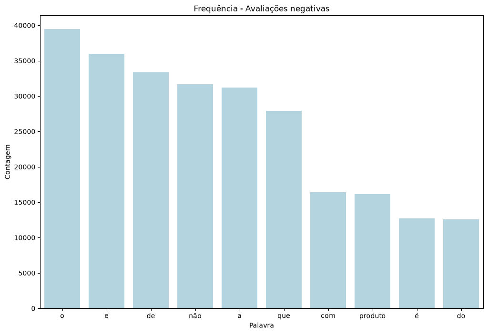
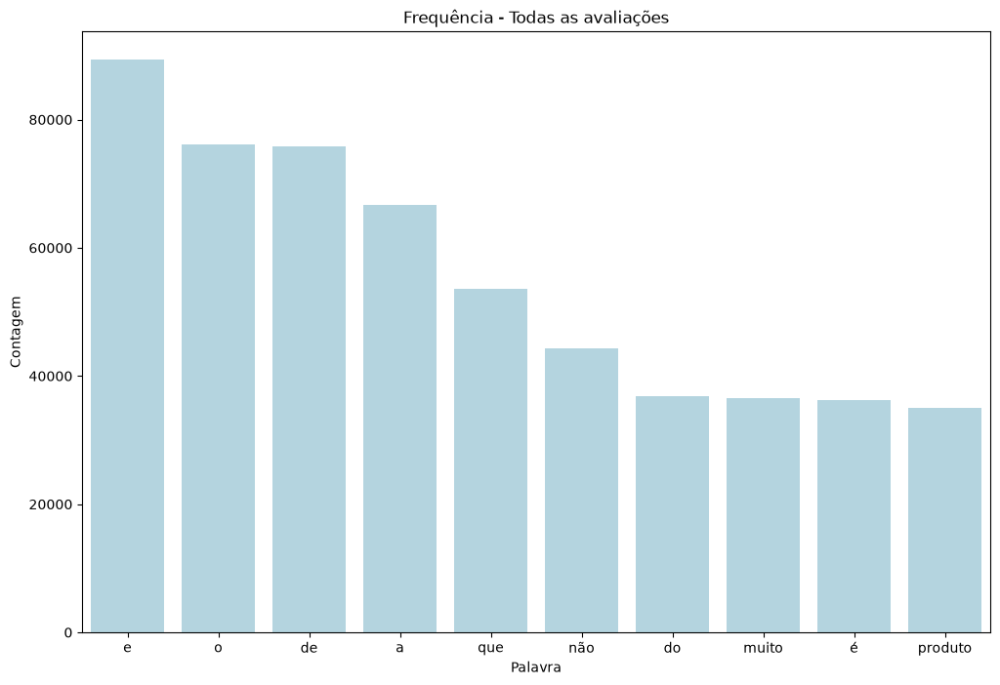
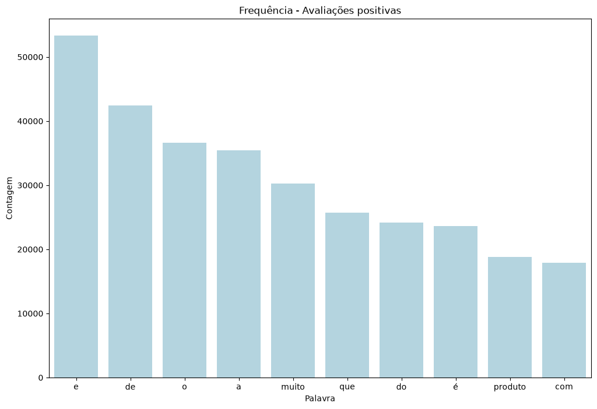

# Bag of Words — Análise de Sentimento de Avaliações

## Visão geral

Este projeto aplica a técnica de **Bag of Words** para classificar o sentimento (positivo/negativo) de avaliações de produtos escritas em português brasileiro. A solução reúne carregamento e limpeza de dados, vetorização de texto, treinamento de um modelo de classificação e geração de nuvens de palavras para análise exploratória do vocabulário utilizado em cada polaridade.

## Objetivo do projeto

- Transformar texto livre (avaliações de clientes) em uma representação numérica (Bag of Words) que possa ser usada por um modelo de Machine Learning.
- Treinar um classificador de **Regressão Logística** capaz de prever a polaridade (positiva/negativa) de uma avaliação a partir do seu texto.
- Explorar visualmente o vocabulário mais frequente das avaliações positivas, negativas e do conjunto total, por meio de nuvens de palavras.

## Funcionalidades principais

- Carregamento e limpeza da base de avaliações (remoção de colunas irrelevantes e de linhas com valores nulos)
- Contagem da distribuição de avaliações por polaridade
- Vetorização de texto com `CountVectorizer` (Bag of Words) e treinamento de um modelo de Regressão Logística
- Avaliação do modelo por acurácia em um conjunto de teste estratificado
- Geração de nuvens de palavras (`WordCloud`) separadas por polaridade (negativas, positivas) e para o conjunto total de avaliações
- Exibição simultânea das três nuvens de palavras em janelas independentes

## Tecnologias

- Python
- pandas
- scikit-learn
- WordCloud
- Matplotlib

## Como executar

1. Clone o repositório:
   ```
   git clone <URL_DO_REPOSITORIO>
   cd "Aula 2 - Bag of Words"
   ```
2. Crie e ative um ambiente virtual:
   ```
   python -m venv .venv
   .venv\Scripts\activate
   ```
3. Instale as dependências:
   ```
   pip install -r requirements.txt
   ```
4. Execute o projeto:
   ```
   python main.py
   ```

## Dados

O dataset utilizado é o **PT-BR Sentiment Analysis Datasets**, contendo avaliações de produtos em português brasileiro rotuladas com sua polaridade (positiva/negativa).

- Fonte: https://www.kaggle.com/datasets/fredericods/ptbr-sentiment-analysis-datasets
- Tipo: classificação binária de sentimento (positivo vs negativo)
- Arquivo utilizado: `data/Brazilian-Portuguese-Sentiment-Analysis-Datasets.csv`
- Colunas relevantes mantidas: `review_text` (texto da avaliação) e `polarity` (0 = negativo, 1 = positivo)

## Estrutura do projeto

```
data/
  Brazilian-Portuguese-Sentiment-Analysis-Datasets.csv   # base de avaliações
main.py                                                   # pipeline completo do projeto
requirements.txt                                          # dependências do projeto
```

Por ser um projeto de estudo de escopo reduzido, todo o pipeline está concentrado em `main.py`, organizado nas seguintes funções:

- `treinar_modelo`: vetoriza o texto (Bag of Words) e treina/avalia o modelo de Regressão Logística
- `obter_palavras_negativas` / `obter_palavras_positivas` / `obter_todas_palavras`: extraem e concatenam o texto das avaliações por polaridade
- `gerar_nuvem_palavras`: gera o objeto `WordCloud` a partir de um texto
- `exibir_nuvem_palavras`: exibe a nuvem de palavras em uma janela nomeada com `matplotlib`

## Decisões arquiteturais

**Bag of Words com `max_features=100`**
O vocabulário do vetorizador é limitado às 100 palavras mais frequentes. Isso reduz a dimensionalidade do problema e o custo computacional, mantendo o foco nos termos com maior poder discriminativo entre avaliações positivas e negativas.

**Divisão estratificada em treino e teste**
O `train_test_split` utiliza `stratify` na coluna de polaridade, preservando a proporção entre avaliações positivas e negativas tanto no treino quanto no teste, evitando que o modelo seja avaliado em um conjunto de teste desbalanceado.

**Funções de extração de palavras separadas por polaridade**
As avaliações negativas, positivas e o conjunto total são isolados em três funções distintas (`obter_palavras_negativas`, `obter_palavras_positivas`, `obter_todas_palavras`), permitindo reutilizar a mesma função de geração/exibição de nuvem de palavras (`gerar_nuvem_palavras` + `exibir_nuvem_palavras`) para os três cenários, sem duplicação de lógica de plotagem.

**Exibição simultânea das nuvens de palavras**
`plt.show()` é chamado uma única vez, após a criação das três figuras (cada uma com um `num`/título próprio). Isso evita que as janelas fiquem bloqueando a execução uma por vez e permite comparar visualmente as três nuvens de palavras ao mesmo tempo.

## Fluxo do pipeline

1. Carregamento da base de avaliações (`data/Brazilian-Portuguese-Sentiment-Analysis-Datasets.csv`)
2. Remoção de colunas desnecessárias (`original_index`, `review_text_processed`, `review_text_tokenized`, `rating`, `kfold_polarity`, `kfold_rating`)
3. Remoção de linhas com valores nulos
4. Contagem da distribuição de avaliações por polaridade
5. Vetorização do texto com Bag of Words (`CountVectorizer`) e divisão estratificada em treino/teste
6. Treinamento do modelo de Regressão Logística e cálculo da acurácia no conjunto de teste
7. Extração das palavras das avaliações negativas, positivas e totais
8. Geração das nuvens de palavras para cada um dos três grupos
9. Exibição simultânea das três nuvens de palavras

## Modelo avaliado

- Regressão Logística (`LogisticRegression`), com features geradas por `CountVectorizer` (Bag of Words)

## Métrica de avaliação

- **Acurácia** no conjunto de teste, calculada com `regressao_logistica.score(X_test, y_test)`

## Resultados

- **Acurácia do modelo (Regressão Logística + Bag of Words):** ~0.887

### Nuvem de palavras — Avaliações negativas



### Nuvem de palavras — Todas as avaliações



### Nuvem de palavras — Avaliações positivas



### Palavras mais frequentes — Avaliações negativas

> **Nota:** contagem bruta de palavras (via `nltk.FreqDist`), **sem remoção de stop words** — por isso palavras como "e", "de", "que" e "o" aparecem entre as mais frequentes.



### Palavras mais frequentes — Todas as avaliações



### Palavras mais frequentes — Avaliações positivas



## Versionamento

1. Bag of Words e WordCloud
